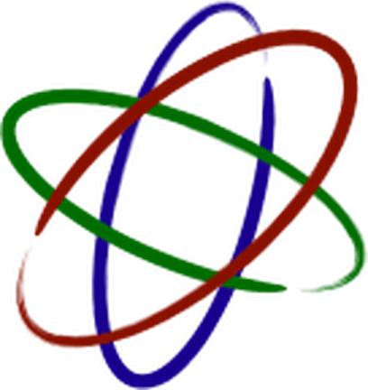

<h1 align="center">Neutron</h1>

  

  
  
  
  

The proton mac never had.

> [!WARNING]
> This project is NOT a replacment for crossover.

Neutron runs Windows Steam games on macOS through the native Steam client and
MacNCheese's unified wine, so there is no Windows Steam client in the loop. A game's
own `steam_api64.dll` talks to the real (arm64) Steam over a wine dll ported
from Proton that loads the x86_64 slice of `steamclient.dylib`; a small stub
`steam.exe` provides the running process the api checks for; Steam's Play button
runs a shim that launches the game under wine.

This repo is the installer. The engine it ships is MacNCheese's unified wine,
built by that project, not by this one; it travels inside the `.app` bundle and
is not part of this source tree. The one binary here is
`vendor/dxvk-1.10.3/x86_64/dxgi.dll`, which the DXVK backend needs.

## the policy: macOS first, Neutron for the rest

macOS Steam already downloads and runs a game's macOS build whenever it has one,
so Neutron never touches those and leaves them to Steam. It only handles
Windows-only titles. It never forces Steam's platform to Windows globally, which
would drag native Mac games onto their Windows depots.

    neutron scan     classify installed games: native mac (Steam) vs neutron

`add` refuses a game that has a macOS build unless you pass `--force`, and
`install --all` wires only the Windows-only ones.

## install

The normal way is the `.app` from the releases page: drag it to Applications,
right-click it and choose Open (it is not notarised, so a plain double-click
gets refused the first time), then click Install. It unpacks the bundled engine
once and wires up the runtime; after that the app is optional and only holds the
settings.

From a checkout (you supply your own wine build):

    NEUTRON_DEV_WINE=/path/to/wine/build64 ./neutron install
    ./neutron scan              # see what is native vs windows-only
    ./neutron get <appid>       # get a game the right way (see below)
    ./neutron status
    ./neutron uninstall

## getting a game

After `apply`, a Windows-only game shows its own Install button in Steam and
downloads through Steam like anything else. Neutron does this by adding a macOS
launch entry to that app's entry in Steam's local `appinfo.vdf`, pointing at a
shim; Steam then treats the game as playable on this machine and handles the
download, the appmanifest and updates itself.

    ./neutron apply             # quit Steam first. enables every windows-only game
    ./neutron enable-game <id>  # one game
    ./neutron force <id>        # a game whose mac build you do not want (cs2)

The overlay does not survive Steam refreshing an app's metadata, so `install`
also sets up a watcher that puts it back. `sync` does the same by hand.

For a Windows game already on disk, or one outside your library:

    ./neutron add <appid>
    ./neutron add-exe "<name>" /path/to/game.exe [appid]

`get <appid>` is the older manual route: it drives `download_depot` on the Steam
console, which ignores the client platform.

All of these edit Steam config, so quit Steam first. Originals are backed up
under `~/Library/Application Support/Neutron/steam-backup`.

## building the .app

The engine is packed once and reused:

    ./build-wine-bundle.sh /path/to/unified-wine dist/wine-unified-bundle.zip
    ./build-ui.sh dist dist/wine-unified-bundle.zip
    ./build-dmg.sh 0.2

The wine build dir must have `loader/wine` and, built into it,
`dlls/lsteamclient`. `build-wine-bundle.sh` drops object files, static libs and
wine's per-dll test suites (about half the tree, none of it needed to run a
game) and copies `nls/` and `fonts/` for real rather than shipping the symlinks,
which would dangle on someone else's machine. The zip lands in the app's
Resources; the installer unpacks it on first run. Nothing here is committed to
this repo.

The steam stub is prebuilt into the app so the target machine needs no compiler.
The DRM forwarders are not prebuilt: they have to match the export table of the
bridge in whichever engine the machine ends up with, and `prebuilt/` is a build
product that never reaches the copy of the installer an update runs, so they are
written on the target instead (see the bridge, below). Sign last: anything
written into the bundle after `codesign` breaks its seal, which is why the
installer sets `PYTHONDONTWRITEBYTECODE`.

## layout

    neutron               the installer
    neutron-run           the launch shim, runs a windows exe under wine
    ui/NeutronApp.swift   the installer window
    build-wine-bundle.sh  packs the engine into a zip
    build-ui.sh           builds Neutron.app around it
    build-dmg.sh          wraps that into a disk image
    make-icon.py          Logo.png -> app icon + the mark the ui draws
    src/neutron-launch    what Steam runs as the game's "macOS build"
    src/appinfo_write.py  binary appinfo.vdf rewriter
    src/appoverlay.py     the per-app overlay written through it
    src/adopt.py          makes Steam treat a downloaded game as a real install
    src/steam_stub.c      the stub steam.exe
    src/peforward.py      reads the bridge's exports, writes the drm forwarder
    src/appinfo.py        reads appinfo.vdf: native-mac vs windows-only
    src/classify.py       per-app verdict + action over the library
    src/gameexe.py        resolves an installed app to its windows exe
    src/shortcuts.py      adds/removes non-steam shortcuts in shortcuts.vdf
    test/                 standalone bringup checks (dev)

## the bridge

`lsteamclient` is a wine dll (Proton sources plus a macOS port: dylib loading,
wine 11 path helpers, minimal C++ support in the build). It lives in the wine
tree, not here, and ships inside the unified wine. Build it with
`make dlls/lsteamclient/all` in the wine `build64`.

A Steamworks-DRM game needs one more thing. The DRM wrapper loads whatever
`SteamClientDll64` names, then looks that module back up by the literal name
`steamclient.dll` to reach `Steam_ReleaseThreadLocalMemory`. `GetModuleHandle`
only ever finds an already loaded module and never touches the disk, so the file
the registry names has to itself be called `steamclient.dll`, or the game stops
at "Application load error 3:0000065432". The bridge cannot take that name: it
looks for a module called `steamclient.dll` and bump-allocates its interface
objects into that module's `.data`, so as that module it writes over its own
globals and faults in ntdll.

So the Steam directory holds pure PE export forwarders under Steam's names, and
every one of them points at the single real bridge, staged in `system32` and
`syswow64` as `lsteamclient.dll`. However many of those a process loads there is
still one live bridge in it, which is the thing that matters: two crashes CS2
before it draws. A forwarder has no code and no `.data`, so the bridge keeps
allocating from the heap exactly as it did before.

`src/peforward.py` writes them. It emits the PE itself — a header, an export
directory of forward strings, and nothing else — rather than driving a cross
compiler, because the machine that needs one regenerated is a user's: it has no
mingw and no build tree, and a forwarder that could only be produced where a
compiler exists would silently stop being staged the first time an engine update
replaced the bridge. Each one is read back through the same parser and checked
against the bridge before it is allowed into a prefix — same exports, every one
of them a forward, `CreateInterface` and `Steam_ReleaseThreadLocalMemory` among
them, names in ascii order so `GetProcAddress` can binary-search them, and no
`.data`. If any of that fails, nothing is staged and the plain layout stays, so
the worst case is the one that worked before forwarders existed.

## limits

- 64-bit games. The 32-bit side builds but has no wow64 thunks yet.
- A Windows-only game must be downloaded first, which needs Steam's platform
  briefly set to Windows (see `download` above). Don't let native Mac games
  update while that override is on, or Steam pulls their Windows depots too.

### CS2 matchmaking does not work, and cannot be made to

CS2 runs and plays, but Premier and Competitive do not, and nothing Neutron
could ship would change that. The refusal is Valve's Game Coordinator returning
`NotVacVerified`: a session is only flagged VAC-verified once the Steam client
has run that app's VAC module, and Valve splits those by operating system in
appinfo, `sourceinit.dat` for Windows and `sourceinit_macos.dat` for macOS.
Neutron is a macOS Steam client supervising a Windows game process, so it sits
across that split and neither module applies to it. Three more walls stand
behind that one: Valve's own `steamclient`, which is where a VAC module has to
live, is not in the process at all (that module is our bridge); CS2 still uses
Trusted Mode, and every module in a wine process is unsigned; and macOS Steam
ships no Windows binaries whatsoever, with no equivalent of Linux Steam's
`legacycompat/`, which is the only reason the same thing works under Proton.
CS2 has no macOS build either, and the fallback Valve offers Mac users is a
frozen legacy CS:GO build with every feature except official matchmaking. Valve
withheld matchmaking from its own supported Mac path.

What was observed is a refusal rather than a detection: the Game Coordinator
declines to start the session and says why, in a message the client prints.
Whether Valve would treat a client in this shape as anything worse is not
something this document can tell you — no statement of theirs is being cited
here, and none should be read into it. If your account matters to you, do not
use Neutron for VAC-secured play. Anything that does not need a VAC-secured
server is unaffected.

Neutron will not ship anything that defeats, spoofs or evades VAC or any other
anti-cheat, so this stays as it is unless Valve-signed Windows `steamclient`
binaries become obtainable through a supported route.

## built on other people's work

Neutron is an installer and a launch shim. Almost everything that does the
actual work belongs to someone else.

- **[MacNCheese](https://macncheese.app)** builds and maintains the unified wine
  engine Neutron ships. That is the 686 MB in the `.app`: the wine build, the
  /DXMT/DXVK plumbing in `mnc-d3d`, `winemetal`, and the font, TLS,
  Vulkan and SDL libraries. Without it there is no Neutron.
- **[Wine](https://winehq.org)**, LGPL 2.1 or later, is what runs the games.
- **[Proton](https://github.com/ValveSoftware/Proton)** is where `lsteamclient`
  comes from. Neutron uses a macOS port of it: dylib loading instead of `.so`,
  wine 11 path helpers, and the Steam presence signals in the `steam.exe` stub
  are copied from Proton's `steam_helper`.
- **[DXVK](https://github.com/doitsujin/dxvk)**, **[DXMT](https://github.com/3Shain/dxmt)**
  and **MoltenVK** provide the graphics translation.
- **D3DMetal** is Apple's, from the Game Porting Toolkit. It is not
  redistributable, which is why you supply your own copy.

## A few other things to address.
- AI was used in this project and simply because I haven't learnt how to code in C++ Swift nor C only in python and some shell
- I wrote most of the python code myself at the beginning but then slowly used AI for modifying and improving the code itself.

If you want a supported, commercially backed way to run Windows software on
macOS, buy [CrossOver](https://www.codeweavers.com/crossover). CodeWeavers pay
for a large share of the upstream wine work everything here depends on.
