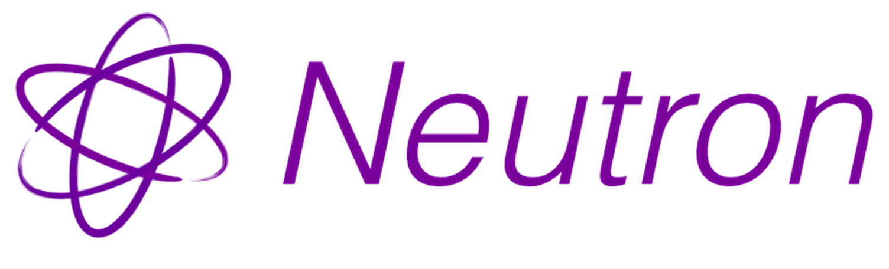

  

  
  
  
  

The proton mac never had.

Neutron runs Windows Steam games on macOS through the native Steam client and a
custom unified wine, so there is no Windows Steam client in the loop. A game's
own `steam_api64.dll` talks to the real (arm64) Steam over a wine dll ported
from Proton that loads the x86_64 slice of `steamclient.dylib`; a small stub
`steam.exe` provides the running process the api checks for; Steam's Play button
runs a shim that launches the game under wine.

This repo is the installer. The unified wine engine is shipped separately inside
a `.app` bundle and is not part of this source tree. The one binary here is
`vendor/dxvk-1.10.3/x86_64/dxgi.dll`, which the DXVK backend needs.

## the policy: macOS first, Neutron for the rest

macOS Steam already downloads and runs a game's macOS build whenever it has one,
so Neutron never touches those and leaves them to Steam. It only handles
Windows-only titles. It never forces Steam's platform to Windows globally, which
would drag native Mac games onto their Windows depots.

    neutron scan     classify installed games: native mac (Steam) vs neutron

`add` refuses a game that has a macOS build unless you pass `--force`, and
`install --all` wires only the Windows-only ones.

## install

The normal way is the `.app` from the releases page: drag it to Applications,
right-click it and choose Open (it is not notarised, so a plain double-click
gets refused the first time), then click Install. It unpacks the bundled engine
once and wires up the runtime; after that the app is optional and only holds the
settings.

From a checkout (you supply your own wine build):

    NEUTRON_DEV_WINE=/path/to/wine/build64 ./neutron install
    ./neutron scan              # see what is native vs windows-only
    ./neutron get <appid>       # get a game the right way (see below)
    ./neutron status
    ./neutron uninstall

## getting a game

After `apply`, a Windows-only game shows its own Install button in Steam and
downloads through Steam like anything else. Neutron does this by adding a macOS
launch entry to that app's entry in Steam's local `appinfo.vdf`, pointing at a
shim; Steam then treats the game as playable on this machine and handles the
download, the appmanifest and updates itself.

    ./neutron apply             # quit Steam first. enables every windows-only game
    ./neutron enable-game <id>  # one game
    ./neutron force <id>        # a game whose mac build you do not want (cs2)

The overlay does not survive Steam refreshing an app's metadata, so `install`
also sets up a watcher that puts it back. `sync` does the same by hand.

For a Windows game already on disk, or one outside your library:

    ./neutron add <appid>
    ./neutron add-exe "<name>" /path/to/game.exe [appid]

`get <appid>` is the older manual route: it drives `download_depot` on the Steam
console, which ignores the client platform.

All of these edit Steam config, so quit Steam first. Originals are backed up
under `~/Library/Application Support/Neutron/steam-backup`.

## building the .app

The engine is packed once and reused:

    ./build-wine-bundle.sh /path/to/unified-wine dist/wine-unified-bundle.zip
    ./build-ui.sh dist dist/wine-unified-bundle.zip
    ./build-dmg.sh 0.2

The wine build dir must have `loader/wine` and, built into it,
`dlls/lsteamclient`. `build-wine-bundle.sh` drops object files, static libs and
wine's per-dll test suites (about half the tree, none of it needed to run a
game) and copies `nls/` and `fonts/` for real rather than shipping the symlinks,
which would dangle on someone else's machine. The zip lands in the app's
Resources; the installer unpacks it on first run. Nothing here is committed to
this repo.

The steam stub is prebuilt into the app so the target machine needs no compiler.
Sign last: anything written into the bundle after `codesign` breaks its seal,
which is why the installer sets `PYTHONDONTWRITEBYTECODE`.

## layout

    neutron               the installer
    neutron-run           the launch shim, runs a windows exe under wine
    ui/NeutronApp.swift   the installer window
    build-wine-bundle.sh  packs the engine into a zip
    build-ui.sh           builds Neutron.app around it
    build-dmg.sh          wraps that into a disk image
    make-icon.py          Logo.png -> app icon + the mark the ui draws
    src/neutron-launch    what Steam runs as the game's "macOS build"
    src/appinfo_write.py  binary appinfo.vdf rewriter
    src/appoverlay.py     the per-app overlay written through it
    src/adopt.py          makes Steam treat a downloaded game as a real install
    src/steam_stub.c      the stub steam.exe
    src/appinfo.py        reads appinfo.vdf: native-mac vs windows-only
    src/classify.py       per-app verdict + action over the library
    src/gameexe.py        resolves an installed app to its windows exe
    src/shortcuts.py      adds/removes non-steam shortcuts in shortcuts.vdf
    test/                 standalone bringup checks (dev)

## the bridge

`lsteamclient` is a wine dll (Proton sources plus a macOS port: dylib loading,
wine 11 path helpers, minimal C++ support in the build). It lives in the wine
tree, not here, and ships inside the unified wine. Build it with
`make dlls/lsteamclient/all` in the wine `build64`.

## limits

- 64-bit games. The 32-bit side builds but has no wow64 thunks yet.
- A Windows-only game must be downloaded first, which needs Steam's platform
  briefly set to Windows (see `download` above). Don't let native Mac games
  update while that override is on, or Steam pulls their Windows depots too.
